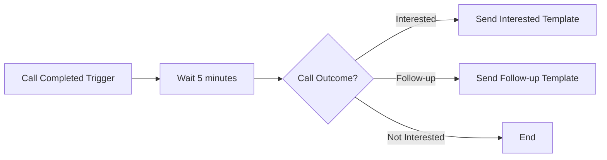
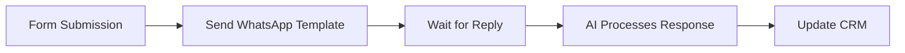
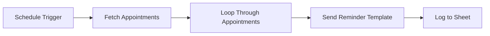

---
---
title: "WhatsApp Автоматизация"
icon: "bolt"
description: "Автоматизирайте WhatsApp съобщения с тригери и действия в платформата за автоматизация"
---

Платформата за автоматизация се интегрира с WhatsApp, за да ви позволи да изпращате съобщения автоматично, да задействате потоци от WhatsApp събития и да генерирате AI отговори програмно.

## Налични Действия

### Изпращане на WhatsApp Template Съобщение

Изпратете предварително одобрено template съобщение до клиент.

**Случаи на употреба:**
- Изпращане на потвърждения за поръчки след покупка
- Задействане на напомняния за срещи по график
- Доставяне на последващи съобщения след повиквания
- Повторно ангажиране на клиенти, които не са отговорили

**Конфигурация:**

| Поле | Описание |
|-------|-------------|
| **Изпращач** | Изберете вашия WhatsApp изпращач (трябва да е онлайн) |
| **Template** | Изберете от одобрени template-и |
| **Телефон на Получател** | Телефонен номер на клиента (E.164 формат: +1234567890) |
| **Име на Получател** | Незадължително име на клиента за персонализация |
| **Variables** | Динамични стойности за template placeholder-и |

<Tip>
**E.164 Формат** — Телефонните номера трябва да бъдат в международен формат с кода на страната. Примери:
- ✅ `+14155551234`
- ✅ `+442071234567`
- ❌ `(415) 555-1234`
- ❌ `07123456789`
</Tip>

### Изпращане на WhatsApp Съобщение (Свободна форма)

Изпратете текстово съобщение в свободна форма до клиент в рамките на 24-часовия прозорец за съобщения.

<Warning>
**Изисква се 24-часов прозорец** — Съобщения в свободна форма могат да се изпращат само до клиенти, които са ви писали през последните 24 часа. За клиенти извън този прозорец, използвайте template съобщение.
</Warning>

**Случаи на употреба:**
- Изпращане на незабавен отговор на скорошни разговори
- Доставяне на спешна информация
- Автоматичен отговор на клиентски запитвания

**Конфигурация:**

| Поле | Описание |
|-------|-------------|
| **Изпращач** | Изберете вашия WhatsApp изпращач |
| **Телефон на Получател** | Телефонен номер на клиента (E.164 формат) |
| **Съобщение** | Съдържание на съобщението (максимум 4096 символа) |

### Генериране на AI Отговор

Генерирайте AI отговор, използвайки вашия асистент, идентифициран чрез външен клиентски идентификатор.

**Случаи на употреба:**
- Изграждане на персонализирани чат интерфейси
- Интегриране на WhatsApp с външни CRM системи
- Създаване на многоканални AI отговори
- Обработка на съобщения от външни платформи

**Конфигурация:**

| Поле | Описание |
|-------|-------------|
| **Асистент** | Изберете AI асистента за използване |
| **Клиентски Идентификатор** | Уникален клиентски ID (напр. телефонен номер, email, CRM ID) |
| **Съобщение** | Съобщението, на което да се отговори |
| **Variables** | Незадължителни контекстови променливи за асистента |

**Как работи:**
1. Действието намира или създава разговор за клиентския идентификатор
2. Изпраща съобщението до вашия AI асистент
3. Връща AI-генерирания отговор
4. След това можете да изпратите този отговор чрез WhatsApp или други канали

## Тригери

### WhatsApp Съобщение Получено

Задействайте поток, когато клиент изпрати WhatsApp съобщение.

**Налични данни:**
- Телефонен номер на клиента
- Съдържание на съобщението
- ID на изпращача
- Времева отметка
- ID на разговора

**Примерни случаи на употреба:**
- Записване на съобщения в CRM или база данни
- Изпращане на известия до вашия екип
- Задействане на последващи поредици
- Събиране и обработка на клиентски данни

### WhatsApp Разговор Започнат

Задействайте поток, когато започне нов WhatsApp разговор.

**Налични данни:**
- Телефонен номер на клиента
- Съдържание на първото съобщение
- Информация за изпращача
- ID на разговора

### Разговор Приключен

Задействайте поток, когато WhatsApp разговор приключи (поради изтичане на време за неактивност или ръчно затваряне).

**Налични данни:**
- Пълен запис на разговора (масив от съобщения и форматиран низ)
- Извлечени променливи (от AI post-call оценка)
- Входни променливи, подадени на асистента
- Телефонен номер и име на клиента
- WhatsApp информация за изпращача (телефонен номер, показвано име)
- ID и тип на разговора
- Брой съобщения
- Времеви отметки (created_at, ended_at)

**Примерни случаи на употреба:**
- Синхронизиране на резюмета на разговори и извлечени данни към вашия CRM
- Задействане на последващи поредици въз основа на резултатите от разговора
- Записване на аналитика на разговори във външни системи
- Изпращане на анкети за удовлетвореност след приключване на разговори

<Tip>
Тригерът Разговор Приключен предоставя същия payload като [Conversation Ended Webhook](/api-reference/webhooks/conversation-ended-webhook). Използвайте webhook-а за директни интеграции или този тригер за no-code automation потоци.
</Tip>

## Примерни Работни Потоци

### Post-Call WhatsApp Последващо Съобщение

Изпратете WhatsApp template съобщение след приключване на повикване:



**Настройка:**
1. Добавете **Call Completed** тригер
2. Добавете **Delay** действие (незадължително)
3. Добавете **Branch** въз основа на резултата от повикването
4. Добавете **Send WhatsApp Template** действие за всеки клон
5. Конфигурирайте template и променливи

### Квалифициране на Lead-ове чрез WhatsApp

Квалифицирайте потенциални клиенти чрез WhatsApp разговори:



### Поток за Напомняне на Срещи

Изпращайте автоматични напомняния за срещи:



## Мапиране на Променливи

При изпращане на template съобщения, мапирайте данните от вашия поток към template променливи:

**Template:**
```
Здравейте {{1}}, вашата среща с {{2}} е потвърдена за {{3}}.

Място: {{4}}
```

**Мапиране на променливи:**
| Template Променлива | Данни от потока |
|------------------|-----------|
| `{{1}}` | `{{trigger.customer_name}}` |
| `{{2}}` | `{{trigger.agent_name}}` |
| `{{3}}` | `{{trigger.appointment_date}}` |
| `{{4}}` | `{{trigger.location}}` |

## Обработка на Грешки

### Често срещани грешки

| Грешка | Причина | Решение |
|-------|-------|----------|
| **Template не е намерен** | Template ID е невалиден или неодобрен | Проверете дали template-ът е одобрен и ID-то е правилно |
| **Изпращачът е офлайн** | WhatsApp изпращачът не е онлайн | Проверете статуса на изпращача, уверете се че е свързан |
| **Невалиден телефонен номер** | Телефонният номер не е в E.164 формат | Форматирайте като +[код на страната][номер] |
| **Извън 24-часовия прозорец** | Опит за изпращане в свободна форма извън прозореца | Използвайте template съобщение вместо това |
| **Rate limited** | Изпратени са твърде много съобщения | Имплементирайте забавяния между съобщенията |

### Стратегия за повторни опити

За неуспешни съобщения, имплементирайте стратегия за повторни опити:

1. Изчакайте 1 минута
2. Повторете действието
3. Ако все още се проваля, записвайте грешката и уведомете вашия екип

## Най-добри практики

### 1. Винаги използвайте Template-и за изходящи съобщения

Когато инициирате контакт с клиенти, винаги използвайте одобрени template-и. Съобщенията в свободна форма работят само в рамките на 24-часовия прозорец.

### 2. Включвайте опции за отказ

За маркетингови съобщения, включвайте инструкции за отказ, за да съответствате на регулациите и да поддържате качествен рейтинг.

### 3. Спазвайте ограниченията за честота

Не изпращайте твърде много съобщения твърде бързо. Имплементирайте разумни забавяния между групови изпращания.

### 4. Обработвайте грешките елегантно

Винаги добавяйте обработка на грешки към вашите потоци. Записвайте неуспехите и уведомявайте вашия екип за проблемите.

### 5. Тествайте първо с единични получатели

Преди да стартирате масови кампании, тествайте вашия поток с единичен получател, за да проверите че всичко работи правилно.

### 6. Наблюдавайте рейтинга за качество

Следете рейтинга за качество на вашия изпращач. Паузирайте кампаниите, ако забележите намаляващо качество.

## Следващи стъпки

- Научете за [message template-и](/whatsapp/templates) и как да ги създавате
- Настройте [WhatsApp изпращачи](/whatsapp/senders) за вашите телефонни номера
- Разгледайте [платформата за автоматизация](/automation-platform/introduction) за повече опции за работни потоци

---