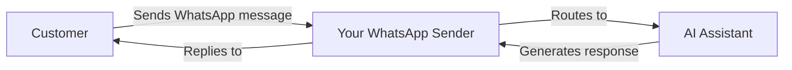

<Note>
**Ново: Външни номера** — Вече можете да използвате собствения си мобилен номер за WhatsApp! Използвайте номера от платформата или свържете съществуващия си мобилен номер с SMS/гласова верификация.
</Note>

## Какво е WhatsApp Business интеграция?

WhatsApp Business интеграцията ви позволява да свържете своите AI асистенти с WhatsApp, което дава възможност за автоматизирани текстови разговори с клиенти чрез най-популярната messaging платформа в света.

С тази интеграция можете да:

- **Получавате съобщения от клиенти** и да отговаряте автоматично с AI
- **Изпращате template съобщения** за започване на разговори или възобновяване на контакта с клиенти
- **Използвате AI-генерирани отговори** за 24/7 клиентска поддръжка
- **Стартирате автоматизирани процеси** базирани на WhatsApp разговори
- **Проследявате всички разговори** в dashboard-а си

## Как работи

1. **Създайте WhatsApp Sender** използвайки номер от платформата или собствен външен номер
2. **Свържете AI асистент** за автоматично обработване на входящи съобщения
3. **Създайте Message Templates** за изходящи разговори (изискване от Meta)
4. **Клиентите ви изпращат съобщения** и получават AI-генерирани отговори незабавно

## Ключови компоненти

<CardGroup cols={2}>
  <Card title="WhatsApp Senders" icon="phone" href="/whatsapp/senders">
    Телефонни номера регистрирани за WhatsApp Business съобщения
  </Card>
  <Card title="Message Templates" icon="file-lines" href="/whatsapp/templates">
    Предварително одобрени формати на съобщения за започнати от бизнеса разговори
  </Card>
  <Card title="AI Conversations" icon="robot" href="/whatsapp/conversations">
    AI-генерирани автоматизирани отговори на съобщения от клиенти
  </Card>
  <Card title="Automation" icon="bolt" href="/whatsapp/automation">
    Стартиране на процеси и изпращане на съобщения чрез автоматизираната платформа
  </Card>
</CardGroup>

## Разбиране на правилата за WhatsApp Business

WhatsApp има специфични правила за бизнес съобщения, които трябва да разбирате:

### 24-часовия прозорец за съобщения

<Info>
Когато клиент ви изпрати съобщение, се отваря **24-часов прозорец**, в който можете да изпращате свободни съобщения. След като този прозорец се затвори, трябва да използвате **одобрен template** за възобновяване на контакта с клиента.
</Info>

- **В рамките на 24 часа**: Изпращайте всякакви съобщения директно
- **След 24 часа**: Трябва да използвате предварително одобрено template съобщение

### Template съобщения

Template съобщенията са предварително одобрени формати на съобщения, необходими за:

- Започване на нови разговори с клиенти
- Възобновяване на контакта с клиенти след 24-часовия прозорец
- Изпращане на уведомления, актуализации или маркетингови съобщения

Template-ите трябва да бъдат изпратени на Meta за одобрение преди употреба (обикновено отнема минути до 24 часа).

### Quality оценка и лимити

Meta наблюдава качеството на съобщенията ви. Новите senders започват с ограничен капацитет за съобщения, който се увеличава когато поддържате добро качество:

| Quality ниво | Дневен лимит съобщения |
|--------------|------------------------|
| Нов Sender   | ~250 съобщения         |
| Ниско Quality| 1,000 съобщения        |
| Средно       | 10,000 съобщения       |
| Високо Quality| 100,000+ съобщения     |

<Warning>
Високи нива на блокиране или spam сигнали ще понижат вашата quality оценка и ще намалят лимитите ви за съобщения. Винаги изпращайте релевантно, поискано съдържание.
</Warning>

## Поддържани функции

### Какво е поддържано

- **Platform номера** — Използвайте номера закупени чрез нашата платформа с автоматизирана AI верификация
- **Външни номера** — Използвайте собствения си мобилен номер и верифицирайте чрез SMS или гласово повикване
- AI-генерирани автоматизирани отговори
- Template съобщения (Utility, Marketing, Authentication)
- Voice Call Request templates (искане за разрешение за обаждане чрез WhatsApp)
- История и проследяване на разговори
- Интеграция с автоматизираната платформа

### Media и Vision

- **Анализ на изображения (Vision)** — Когато клиентите изпращат изображения, вашият AI асистент може да ги анализира използвайки vision-способни LLM модели (OpenAI, Claude, Gemini). AI описва и отговаря на съдържанието на изображенията в рамките на разговора.
- **Транскрипция на гласови съобщения** — Входящите гласови съобщения се транскрибират автоматично базирано на езиковите настройки на асистента ви. Транскрибираният текст се обработва от AI точно като обикновено съобщение.
- **Media прикачени файлове** — Всички входящи media файлове (изображения, аудио, видео, документи) се съхраняват като прикачени файлове към разговора и са достъпни от dashboard-а ви.

### Очаквайте скоро

- WhatsApp гласови повиквания

## Първи стъпки

<Steps>
  <Step title="Изберете типа номер">
    Решете дали да използвате **platform номер** (закупен от нас) или собствен **външен мобилен номер**. Външните номера трябва да могат да получават SMS или гласови повиквания за верификация.
  </Step>
  <Step title="Създайте WhatsApp Sender">
    Отидете на **WhatsApp Senders** и следвайте setup wizard-а за свързване на номера ви с WhatsApp Business.
  </Step>
  <Step title="Свържете AI асистент">
    Свържете AI асистент за автоматично отговаряне на входящи съобщения.
  </Step>
  <Step title="Създайте Templates">
    Настройте message templates за изходящи разговори и изчакайте одобрение от Meta.
  </Step>
  <Step title="Започнете да изпращате съобщения">
    Вашият WhatsApp sender е готов! Клиентите могат да ви изпращат съобщения и да получават AI-генерирани отговори.
  </Step>
</Steps>

## Следващи стъпки

- Научете как да [създавате WhatsApp senders](/whatsapp/senders)
- Разберете [message templates](/whatsapp/templates) и процеса за одобрение
- Настройте [automation triggers](/whatsapp/automation) за WhatsApp

---