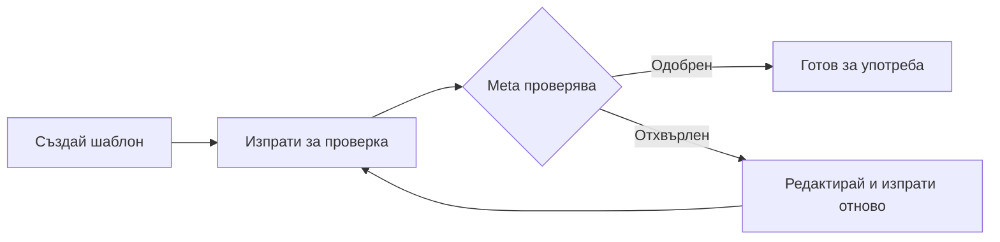

Шаблоните за съобщения са предварително одобрени формати за съобщения, изисквани от Meta за разговори, инициирани от бизнеса в WhatsApp. Трябва да имате одобрени шаблони, преди да можете да изпращате изходящи съобщения до клиенти.

## Какво са шаблоните за съобщения?

Шаблоните за съобщения са структурирани съобщения, които:

- Трябва да бъдат изпратени до Meta за одобрение преди употреба
- Позволяват ви да започнете разговори с клиенти
- Могат да включват променливи за персонализиране
- Са задължителни за съобщения извън 24-часовия прозорец

<Info>
**Защо шаблони?** — WhatsApp изисква шаблони, за да предотврати спам и да гарантира, че бизнесите изпращат ценни, релевантни съобщения до клиентите. Всички съобщения, инициирани от бизнеса, трябва да използват одобрени шаблони.
</Info>

## Кога се нуждаете от шаблони?

| Сценарий | Шаблон задължителен? |
|----------|-------------------|
| Клиентът ви съобщава първи | Не — разрешен е свободен отговор в рамките на 24 часа |
| Отговаряне в рамките на 24 часа | Не — изпратете всяко съобщение |
| Започване на нов разговор | **Да** |
| Възобновяване след 24 часа | **Да** |
| Изпращане на известия/актуализации | **Да** |
| Маркетингови съобщения | **Да** |

## Категории шаблони

Шаблоните са организирани в категории, които определят тяхните изисквания за одобрение и случаи на употреба:

### Utility шаблони

Транзакционни съобщения, свързани с услуги.

**Използвайте за:**
- Потвърждения за поръчки
- Актуализации за доставка
- Напомняния за срещи
- Известия за акаунт
- Разписки за плащания

**Одобрение:** Обикновено се одобряват в рамките на минути

### Маркетингови шаблони

Промоционални съобщения, свързани с продажби.

**Използвайте за:**
- Промоционални оферти
- Обяви за продукти
- Бюлетини
- Продажни кампании
- Съобщения за възобновяване на ангажимент

**Одобрение:** Може да отнеме по-дълго време, по-строга проверка

<Warning>
**Никакво съдържание от различна категория** — Не включвайте промоционално съдържание в Utility шаблони. Meta ще отхвърли шаблони с несъответстващи категория и съдържание.
</Warning>

### Authentication шаблони

Съобщения за верификация и сигурност.

**Използвайте за:**
- Еднократни пароли (OTP)
- Кодове за верификация
- Потвърждения за вход
- Сигурностни предупреждения

**Одобрение:** Стандартна проверка

### Voice Call Request шаблони

Специални шаблони за заявяване на разрешение за WhatsApp гласови повиквания.

**Използвайте за:**
- Заявяване на разрешение за повикване на клиенти чрез WhatsApp глас
- Трябва да включват бутон за заявка за гласово повикване

**Одобрение:** Автоматично (при използване на стандартен формат)

## Създаване на шаблон

### Стъпка 1: Навигирайте до шаблони

1. Отидете на **WhatsApp Senders** → Изберете вашия изпращач → раздел **Templates**
2. Или отидете директно на **WhatsApp Templates**
3. Кликнете **Create Template**

### Стъпка 2: Конфигурирайте основни настройки

| Поле | Описание |
|-------|-------------|
| **Name** | Уникален идентификатор (малки букви, само долни черти). Пример: `order_confirmation_v1` |
| **Category** | Изберете Utility, Marketing, Authentication или Voice Call Request |
| **Language** | Език на шаблона (трябва да съвпада със съдържанието) |

<Tip>
**Най-добри практики за именуване:**
- Използвайте описателни имена: `appointment_reminder`, `order_shipped`
- Включете номера на версии: `welcome_message_v2`
- Избягвайте общи имена: ~~`template1`~~, ~~`test`~~
</Tip>

### Стъпка 3: Напишете съдържанието на шаблона

Шаблоните могат да включват множество компоненти:

#### Header (по избор)
- **Text Header**: Кратко заглавие (до 60 знака)
- **Media Header**: Изображение, видео или документ (скоро)

#### Body (задължително)
Основното съдържание на съобщението. Тук пишете вашето съобщение.

**Използване на променливи:**
Използвайте `{{1}}`, `{{2}}`, и т.н. за динамично съдържание:

```
Здравейте {{1}}, вашата поръчка {{2}} беше изпратена!

Очаквана доставка: {{3}}
Проследете вашия пакет: {{4}}
```

<Info>
**Примерни стойности** — Когато създавате шаблони, трябва да предоставите примерни стойности за всяка променлива. Те помагат на Meta да разбере целта на вашия шаблон и са необходими за одобрение.
</Info>

#### Footer (по избор)
Кратък ред в долната част (до 60 знака). Често се използва за информация за отказ или ограничения.

#### Buttons (по избор)
Добавете интерактивни бутони към вашия шаблон:

- **Quick Reply**: Предефинирани бутони за отговор (напр. "Да", "Не", "Научете повече")
- **Call to Action**: Връзка към уебсайт или телефонен номер
- **Voice Call Request**: Бутон за заявяване на разрешение за гласово повикване

### Стъпка 4: Изпратете за одобрение

1. Прегледайте съдържанието на вашия шаблон
2. Кликнете **Submit for Approval**
3. Статусът на шаблона се променя на "Pending Approval"
4. Изчакайте проверката от Meta (минути до 24 часа)

## Процес на одобрение на шаблон



### Времена за одобрение

| Категория | Типично време |
|----------|-------------|
| Utility | Минути до няколко часа |
| Marketing | Часове до 24 часа |
| Authentication | Минути до няколко часа |
| Voice Call Request | Обикновено мгновено |

### Статуси на шаблони

| Статус | Описание |
|--------|-------------|
| <span style={{color: '#6b7280'}}>**Draft**</span> | Все още не е изпратен |
| <span style={{color: '#f59e0b'}}>**Pending**</span> | Изпратен, очаква проверка от Meta |
| <span style={{color: '#22c55e'}}>**Approved**</span> | Готов за употреба |
| <span style={{color: '#ef4444'}}>**Rejected**</span> | Проверката е неуспешна, вижте причината за отхвърляне |
| <span style={{color: '#6b7280'}}>**Disabled**</span> | Деактивиран от Meta поради ниско качество |

## Честі причини за отхвърляне

Избягвайте тези чести грешки, за да подобрите процента си на одобрение:

### ❌ Промоционално съдържание в Utility шаблони

**Проблем:** Включване на отстъпки, оферти или маркетингов език в Utility шаблони.

**Решение:** Използвайте категория Marketing за промоционално съдържание.

### ❌ Липсващи или неясни примери за променливи

**Проблем:** Променливи като `{{1}}` без ясни примерни стойности.

**Решение:** Предоставете реалистични примерни стойности, които показват целта на променливата:
- ✅ `{{1}}` = "Иван Петров"
- ✅ `{{2}}` = "#12345"
- ❌ `{{1}}` = "test"

### ❌ Агресивен или заплашителен език

**Проблем:** Съдържание, което може да бъде възприето като тормоз, заплахи или спам.

**Решение:** Използвайте професионален, приятелски език. Фокусирайте се върху стойността за клиента.

### ❌ Съкратители на URL адреси

**Проблем:** Използване на bit.ly, tinyurl или други съкратители на URL адреси.

**Решение:** Използвайте пълни, брандирани URL адреси от вашия домейн.

### ❌ Неправилен избор на категория

**Проблем:** Избиране на грешна категория за вашия тип съдържание.

**Решение:** Съпоставете категорията със съдържанието строго според целта.

### ❌ Ограничено съдържание

**Проблем:** Шаблони за алкохол, хазарт, съдържание за възрастни, политически съобщения или незаконни дейности.

**Решение:** Те не са разрешени. Прегледайте търговските политики на Meta.

## Използване на шаблони

### Изпращане на съобщения по шаблон

След одобрение можете да изпращате съобщения по шаблон:

1. **Чрез автоматизационна платформа**: Използвайте действието "Send WhatsApp Template"
2. **Чрез API**: Извикайте send endpoint с template ID и променливи

### Заместване на променливи

При изпращане заместете променливите с действителни стойности:

**Шаблон:**
```
Здравейте {{1}}, вашата среща е потвърдена за {{2}} в {{3}}.
```

**Изпратено съобщение:**
```
Здравейте Иван, вашата среща е потвърдена за 15 януари в 14:00.
```

## Най-добри практики

### 1. Използвайте описателни имена

```
✅ order_confirmation_v1
✅ appointment_reminder
✅ shipping_update_with_tracking
❌ template1
❌ test
❌ message
```

### 2. Поддържайте съобщенията кратки

Потребителите на WhatsApp очакват бързи, ясни съобщения. Стигнете до същността и включете ясна покана за действие.

### 3. Използвайте интерактивни бутони

Добавете Quick Reply или Call-to-Action бутони, за да улесните клиентите да отговорят:

- "Проследи поръчка"
- "Свържи се с поддръжката"
- "Виж детайли"
- "Потвърди среща"

### 4. Тествайте преди масово изпращане

Винаги тествайте вашия шаблон с един получател, преди да изпратите до голяма аудитория. Това помага да откриете проблеми с форматирането.

### 5. Създавайте шаблони рано

Одобрението може да отнеме до 24 часа. Създавайте и изпращайте шаблони преди да се нуждаете от тях.

### 6. Имайте резервни шаблони

Създайте множество версии на важни шаблони. Ако един е отхвърлен или деактивиран, имате готови алтернативи.

## Редактиране на шаблони

<Warning>
**Ограничено редактиране** — След като шаблон е одобрен, не можете да го редактирате. За да направите промени, трябва да създадете нов шаблон с различно име.
</Warning>

**Може да редактирате:**
- Чернови шаблони (все още не са изпратени)
- Отхвърлени шаблони (поправете проблемите и изпратете отново)

**Не можете да редактирате:**
- Одобрени шаблони
- Шаблони в очакване (трябва да изчакате проверката)

## Ограничения за шаблони

Meta налага ограничения върху създаването на шаблони:

- Максимум шаблони на WhatsApp Business акаунт: Варира според нивото на акаунта
- Имената на шаблоните трябва да са уникални за изпращач
- Отхвърлените шаблони се броят към вашия лимит

## Следващи стъпки

- Настройте [автоматизационни тригери](/whatsapp/automation) за автоматично изпращане на шаблони
- Научете за [WhatsApp изпращачи](/whatsapp/senders) и управление на изпращачи
- Прегледайте [конфигурацията на AI асистент](/ai-assistants/what-is-ai-assistant) за отговори в разговори

---